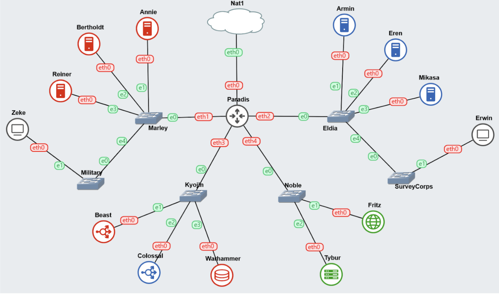

# Jarkom-Modul-3-IT07-2024

- Dimas Andhika Diputra 5027231074
- Kharisma Fahrun Nisa 5027231086

# Topologi



| Node      | Kategori                | Konfigurasi IP |
| --------- | ----------------------- | -------------- |
| Paradis   | Router (DHCP Relay)     | Dynamic        |
| Tybur     | DHCP Server             | Static         |
| Fritz     | DNS Server              | Static         |
| Warhammer | Database Server         | Static         |
| Beast     | Load Balancer (Laravel) | Static         |
| Colossal  | Load Balancer (PHP)     | Static         |
| Annie     | Laravel Worker          | Static         |
| Bertholdt | Laravel Worker          | Static         |
| Reiner    | Laravel Worker          | Static         |
| Armin     | PHP Worker              | Static         |
| Eren      | PHP Worker              | Static         |
| Mikasa    | PHP Worker              | Static         |
| Zeke      | Client                  | Dynamic        |
| Erwin     | Client                  | Dynamic        |

Oleh karena php, image yang saya pakai untuk tiap kategori berbeda-beda:

- Node dengan kategori `PHP Worker` menggunakan image `danielcristh0/debian-buster:1.1`
- Node dengan kategori `Laravel Worker` menggunakan image `debian:latest`
- Node dengan kategori selain PHP Worker dan Laravel Worker menggunakan image `kuuhaku86/gns3-ubuntu:1.0.1`

# Setup

## Paradis

```
auto eth0
iface eth0 inet dhcp

auto eth1
iface eth1 inet static
	address 10.67.1.1
	netmask 255.255.255.0

auto eth2
iface eth2 inet static
	address 10.67.2.1
	netmask 255.255.255.0

auto eth3
iface eth3 inet static
	address 10.67.3.1
	netmask 255.255.255.0

auto eth4
iface eth4 inet static
	address 10.67.4.1
	netmask 255.255.255.0

up iptables -t nat -A POSTROUTING -o eth0 -j MASQUERADE -s 10.67.0.0/16
```

lalu setup `apt-get update && apt install isc-dhcp-relay -y`

## Annie (10.67.1.2) | Laravel Worker

```
auto eth0
iface eth0 inet static
	address 10.67.1.2
	netmask 255.255.255.0
	gateway 10.67.1.1
```

## Berdholdt (10.67.1.3) | Laravel Worker

```
auto eth0
iface eth0 inet static
	address 10.67.1.3
	netmask 255.255.255.0
	gateway 10.67.1.1
```

## Reiner (10.67.1.4) | Laravel Worker

```
auto eth0
iface eth0 inet static
	address 10.67.1.4
	netmask 255.255.255.0
	gateway 10.67.1.1
```

## Zeke | Client

```
auto eth0
iface eth0 inet dhcp
```

## Beast (10.67.3.2) | Load Balancer Laravel

```
auto eth0
iface eth0 inet static
    address 10.67.3.2
    netmask 255.255.255.0
    gateway 10.67.3.1
```

## Colossal (10.67.3.3) | Load Balancer PHP

```
auto eth0
iface eth0 inet static
    address 10.67.3.3
    netmask 255.255.255.0
    gateway 10.67.3.1
```

## Warhammer (10.67.3.4) | Database Server

```
auto eth0
iface eth0 inet static
    address 10.67.3.4
    netmask 255.255.255.0
    gateway 10.67.3.1
```

## Tybur (10.67.4.3) | DHCP Server

```
auto eth0
iface eth0 inet static
    address 10.67.4.3
    netmask 255.255.255.0
    gateway 10.67.4.1
```

## Fritz (10.67.4.2) | DNS Server

```
auto eth0
iface eth0 inet static
    address 10.67.4.2
    netmask 255.255.255.0
    gateway 10.67.4.1

up echo nameserver 192.168.122.1 >> /etc/resolv.conf
```

## Erwin | Client

```
auto eth0
iface eth0 inet dhcp
```

## Armin (10.67.2.2) | PHP Worker

```
auto eth0
iface eth0 inet static
    address 10.67.2.2
    netmask 255.255.255.0
    gateway 10.67.2.1
```

## Eren (10.67.2.3) | PHP Worker

```
auto eth0
iface eth0 inet static
    address 10.67.2.3
    netmask 255.255.255.0
    gateway 10.67.2.1
```

## Mikasa (10.67.2.4) | PHP Worker

```
auto eth0
iface eth0 inet static
    address 10.67.2.4
    netmask 255.255.255.0
    gateway 10.67.2.1
```

# Soal 0

> Pulau Paradis telah menjadi tempat yang damai selama 1000 tahun, namun kedamaian tersebut tidak bertahan selamanya. Perang antara kaum Marley dan Eldia telah mencapai puncak. Kaum Marley yang dipimpin oleh Zeke, me-register domain name marley.yyy.com untuk worker Laravel mengarah pada Annie. Namun ternyata tidak hanya kaum Marley saja yang berinisiasi, kaum Eldia ternyata sudah mendaftarkan domain name eldia.yyy.com untuk worker PHP (0) mengarah pada Armin.

## Fritz (DNS Server)

lalu berikut adalah setup untuk no 0

```
apt-get update && apt-get install bind9 -y

echo '
zone "eldia.it07.com" {
	type master;
	file "/etc/bind/it07/eldia.it07.com";
};' > /etc/bind/named.conf.local

echo '
zone "marley.it07.com" {
	type master;
	file "/etc/bind/it07/marley.it07.com";
};' >> /etc/bind/named.conf.local

mkdir /etc/bind/it07

# SETUP DNS RECORD
echo ';
; BIND data file for local loopback interface
;
$TTL    604800
@       IN      SOA     eldia.it07.com. root.eldia.it07.com. (
                              2         ; Serial
                         604800         ; Refresh
                          86400         ; Retry
                        2419200         ; Expire
                         604800 )       ; Negative Cache TTL
;
@       IN      NS      eldia.it07.com.
@       IN      A       10.67.2.2
@       IN      AAAA    ::1' > /etc/bind/it07/eldia.it07.com

echo "DNS configuration for eldia.it07.com has been set up."

echo ';
; BIND data file for local loopback interface
;
$TTL    604800
@       IN      SOA     marley.it07.com. root.marley.it07.com. (
                              2         ; Serial
                         604800         ; Refresh
                          86400         ; Retry
                        2419200         ; Expire
                         604800 )       ; Negative Cache TTL
;
@       IN      NS      marley.it07.com.
@       IN      A       10.67.1.2
@       IN      AAAA    ::1' > /etc/bind/it07/marley.it07.com

echo "DNS configuration for eldia.it07.com has been set up."
```

Pertama install library untuk setup DNS, lalu set domain name dan path file konfigurasinya, saya letakkan di `/etc/bind/it07`

setelah itu buat foldernya jika belum ada. Terakhir, buat file dns record untuk tiap domain name yang ada di `/etc/bind/named.conf.local` seperti `eldia.it07.com` yang mengarah ke `Armin (10.67.2.2) | PHP Worker` dan `marley.it07.com` yang mengarah ke `Annie (10.67.1.2) | Laravel Worker`

# Soal 1

> Lakukan konfigurasi sesuai dengan peta yang sudah diberikan.

> Jauh sebelum perang dimulai, ternyata para keluarga bangsawan, Tybur dan Fritz, telah membuat kesepakatan sebagai berikut:
> Semua Client harus menggunakan konfigurasi ip address dari keluarga Tybur (dhcp).

sudah dikerjakan di setup dan nomor 0

# Soal 2-5

> Client yang melalui bangsa marley mendapatkan range IP dari [prefix IP].1.05 - [prefix IP].1.25 dan [prefix IP].1.50 - [prefix IP].1.100 (2)

> Client yang melalui bangsa eldia mendapatkan range IP dari [prefix IP].2.09 - [prefix IP].2.27 dan [prefix IP].2 .81 - [prefix IP].2.243 (3)

> Client mendapatkan DNS dari keluarga Fritz dan dapat terhubung dengan internet melalui DNS tersebut (4)

> Dikarenakan keluarga Tybur tidak menyukai kaum eldia, maka mereka hanya meminjamkan ip address ke kaum eldia selama 6 menit. Namun untuk kaum marley, keluarga Tybur meminjamkan ip address selama 30 menit. Waktu maksimal dialokasikan untuk peminjaman alamat IP selama 87 menit. (5)

## Tybur (DHCP Server)

lakukan setup berikut

```
apt-get update && apt-get install isc-dhcp-server -y

echo '
INTERFACESv4="eth0"
INTERFACESv6=""
' > /etc/default/isc-dhcp-server

echo 'subnet 10.67.1.0 netmask 255.255.255.0 {
    range 10.67.1.5 10.67.1.25;
    range 10.67.1.50 10.67.1.100;
    option routers 10.67.1.1;
    option broadcast-address 10.67.1.255;
    option domain-name-servers 10.67.4.2;
    default-lease-time 360; # 6 menit
    max-lease-time 5220;
}

subnet 10.67.2.0 netmask 255.255.255.0 {
    range 10.67.2.9 10.67.2.27;
    range 10.67.2.81 10.67.2.243;
    option routers 10.67.2.1;
    option broadcast-address 10.67.2.255;
    option domain-name-servers 10.67.4.2;
    default-lease-time 1800; # 30 menit
    max-lease-time 5220;
}

subnet 10.67.3.0 netmask 255.255.255.0 {
}' > /etc/dhcp/dhcpd.conf

service isc-dhcp-server restart
```

pertama kita install library `isc-dhcp-server` dan setup network interface dari DHCP Servernya yakni `eth0` lalu bisa lanjut setup DHCP Server sesuai dengan pertanyaan

**Marley**<br>
Pertama untuk bangsa marley karena melalui `eth1` maka subnet `10.67.1.0` dan karena ada 2 range dari soal yang diberikan jadi ada 2 kali pendefinisian range yaitu `range 10.67.1.5 10.67.1.25` dan `range 10.67.1.50 10.67.1.100` dan sesuai nomor 4 dns server mengarah ke IP Fritz `10.67.4.2`. Terakhir, untuk `default-lease-time` di `360 (6 menit)` dan max `5220 (87 menit)` sesuai yang diminta soal

**Eldia**
Lalu untuk bangsa eldia ada 2 pendefinisian range juga yaitu `range 10.67.2.9 10.67.2.27` dan `range 10.67.2.81 10.67.2.243`. Dan juga dns server mengarah ke IP Fritz `10.67.4.2` dan terakhir untuk `default-lease-time` di `1800 (30 menit)` dengan max `5220 (87 menit)`
