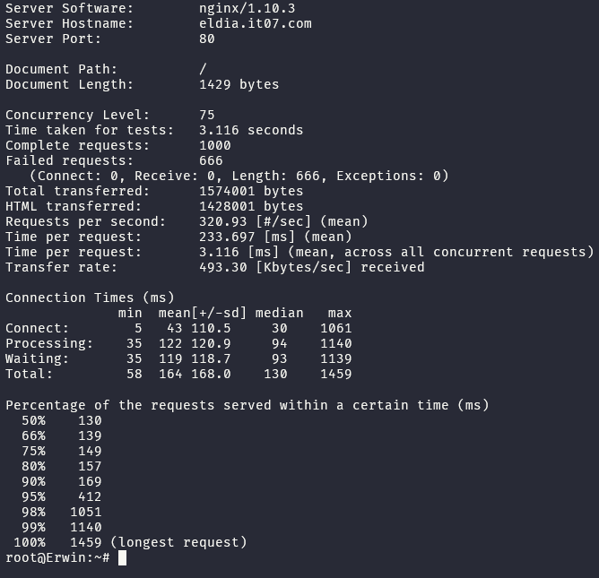

# Jarkom-Modul-3-IT07-2024

- Dimas Andhika Diputra 5027231074
- Kharisma Fahrun Nisa 5027231086

# Topologi


| Node      | Kategori                | Konfigurasi IP |
| --------- | ----------------------- | -------------- |
| Paradis   | Router (DHCP Relay)     | Dynamic        |
| Tybur     | DHCP Server             | Static         |
| Fritz     | DNS Server              | Static         |
| Warhammer | Database Server         | Static         |
| Beast     | Load Balancer (Laravel) | Static         |
| Colossal  | Load Balancer (PHP)     | Static         |
| Annie     | Laravel Worker          | Static         |
| Bertholdt | Laravel Worker          | Static         |
| Reiner    | Laravel Worker          | Static         |
| Armin     | PHP Worker              | Static         |
| Eren      | PHP Worker              | Static         |
| Mikasa    | PHP Worker              | Static         |
| Zeke      | Client                  | Dynamic        |
| Erwin     | Client                  | Dynamic        |

Oleh karena php, image yang saya pakai untuk tiap kategori berbeda-beda:

- Node dengan kategori `PHP Worker` menggunakan image `danielcristh0/debian-buster:1.1`
- Node dengan kategori selain PHP Worker menggunakan image `kuuhaku86/gns3-ubuntu:1.0.1`

# Setup

## Paradis

```
auto eth0
iface eth0 inet dhcp

auto eth1
iface eth1 inet static
	address 10.67.1.1
	netmask 255.255.255.0

auto eth2
iface eth2 inet static
	address 10.67.2.1
	netmask 255.255.255.0

auto eth3
iface eth3 inet static
	address 10.67.3.1
	netmask 255.255.255.0

auto eth4
iface eth4 inet static
	address 10.67.4.1
	netmask 255.255.255.0

up iptables -t nat -A POSTROUTING -o eth0 -j MASQUERADE -s 10.67.0.0/16
```

lalu setup :

```bash
apt-get update && apt-get install isc-dhcp-relay -y
service isc-dhcp-relay start
```

## Annie (10.67.1.2) | Laravel Worker

```
auto eth0
iface eth0 inet static
	address 10.67.1.2
	netmask 255.255.255.0
	gateway 10.67.1.1

up echo 'nameserver 10.67.4.3' > /etc/resolv.conf
```

lalu setup :

```bash
apt-get update && apt-get install mariadb-client -y
```

## Bertholdt (10.67.1.3) | Laravel Worker

```
auto eth0
iface eth0 inet static
	address 10.67.1.3
	netmask 255.255.255.0
	gateway 10.67.1.1

up echo 'nameserver 10.67.4.3' > /etc/resolv.conf
```

lalu setup :

```bash
apt-get update && apt-get install mariadb-client -y
```

## Reiner (10.67.1.4) | Laravel Worker

```
auto eth0
iface eth0 inet static
	address 10.67.1.4
	netmask 255.255.255.0
	gateway 10.67.1.1

up echo 'nameserver 10.67.4.3' > /etc/resolv.conf
```

lalu setup :

```bash
apt-get update && apt-get install mariadb-client -y
```

## Zeke | Client

```
auto eth0
iface eth0 inet dhcp
hwaddress ether 52:e8:ed:09:9f:2f

up echo 'nameserver 10.67.4.3' > /etc/resolv.conf
```

lalu setup :

```bash
apt-get update
apt install lynx -y
apt install htop -y
apt install apache2-utils -y
apt-get install jq -y
```

## Beast (10.67.3.3) | Load Balancer Laravel

```
auto eth0
iface eth0 inet static
    address 10.67.3.3
    netmask 255.255.255.0
    gateway 10.67.3.1
```

## Colossal (10.67.3.4) | Load Balancer PHP

```
auto eth0
iface eth0 inet static
    address 10.67.3.4
    netmask 255.255.255.0
    gateway 10.67.3.1

up echo 'nameserver 10.67.4.3' > /etc/resolv.conf
```

lalu setup :

```bash
apt-get update
apt-get install bind9 -y
apt-get install apache2-utils -y
apt-get install nginx -y
apt-get install lynx -y
service nginx start
```

## Warhammer (10.67.3.2) | Database Server

```
auto eth0
iface eth0 inet static
    address 10.67.3.2
    netmask 255.255.255.0
    gateway 10.67.3.1

up echo 'nameserver 10.67.4.3' > /etc/resolv.conf
```

lalu setup :

```bash
apt-get update && apt-get install mariadb-server -y
service mysql start
```

## Tybur (10.67.4.2) | DHCP Server

```
auto eth0
iface eth0 inet static
    address 10.67.4.2
    netmask 255.255.255.0
    gateway 10.67.4.1

up echo 'nameserver 10.67.4.3' > /etc/resolv.conf
```

lalu setup :

```bash
apt-get update && apt install isc-dhcp-server -y
```

## Fritz (10.67.4.3) | DNS Server

```
auto eth0
iface eth0 inet static
    address 10.67.4.3
    netmask 255.255.255.0
    gateway 10.67.4.1

up echo nameserver 192.168.122.1 >> /etc/resolv.conf
```

lalu setup :

```bash
apt-get update && apt-get install bind9 -y
```

## Erwin | Client

```
auto eth0
iface eth0 inet dhcp
hwaddress ether 46:ef:47:d2:68:84
```

lalu setup :

```bash
apt-get update
apt install lynx -y
apt install htop -y
apt install apache2-utils -y
apt-get install jq -y
```

## Armin (10.67.2.2) | PHP Worker

```
auto eth0
iface eth0 inet static
    address 10.67.2.2
    netmask 255.255.255.0
    gateway 10.67.2.1

up echo 'nameserver 10.67.4.3' > /etc/resolv.conf
```

lalu setup :

```bash
apt-get update
apt-get install nginx -y
apt-get install wget unzip -y
apt-get install php7.3-fpm php7.3-common php7.3-mysql php7.3-gmp php7.3-curl php7.3-intl php7.3-mbstring php7.3-xmlrpc php7.3-gd php7.3-xml php7.3-cli php7.3-zip -y
```

## Eren (10.67.2.3) | PHP Worker

```
auto eth0
iface eth0 inet static
    address 10.67.2.3
    netmask 255.255.255.0
    gateway 10.67.2.1

up echo 'nameserver 10.67.4.3' > /etc/resolv.conf
```

lalu setup :

```bash
apt-get update
apt-get install nginx -y
apt-get install wget unzip -y
apt-get install php7.3-fpm php7.3-common php7.3-mysql php7.3-gmp php7.3-curl php7.3-intl php7.3-mbstring php7.3-xmlrpc php7.3-gd php7.3-xml php7.3-cli php7.3-zip -y
```

## Mikasa (10.67.2.4) | PHP Worker

```
auto eth0
iface eth0 inet static
    address 10.67.2.4
    netmask 255.255.255.0
    gateway 10.67.2.1

up echo 'nameserver 10.67.4.3' > /etc/resolv.conf
```

lalu setup :

```bash
apt-get update
apt-get install nginx -y
apt-get install wget unzip -y
apt-get install php7.3-fpm php7.3-common php7.3-mysql php7.3-gmp php7.3-curl php7.3-intl php7.3-mbstring php7.3-xmlrpc php7.3-gd php7.3-xml php7.3-cli php7.3-zip -y
```

# Soal 0-1

> Pulau Paradis telah menjadi tempat yang damai selama 1000 tahun, namun kedamaian tersebut tidak bertahan selamanya. Perang antara kaum Marley dan Eldia telah mencapai puncak. Kaum Marley yang dipimpin oleh Zeke, me-register domain name marley.yyy.com untuk worker Laravel mengarah pada Annie. Namun ternyata tidak hanya kaum Marley saja yang berinisiasi, kaum Eldia ternyata sudah mendaftarkan domain name eldia.yyy.com untuk worker PHP (0) mengarah pada Armin.

## Fritz (DNS Server)

lalu berikut adalah setup untuk no 0

```bash
echo '
zone "eldia.it07.com" {
	type master;
	file "/etc/bind/it07/eldia.it07.com";
};' > /etc/bind/named.conf.local

echo '
zone "marley.it07.com" {
	type master;
	file "/etc/bind/it07/marley.it07.com";
};' >> /etc/bind/named.conf.local

mkdir /etc/bind/it07

# SETUP DNS RECORD
echo ';
; BIND data file for local loopback interface
;
$TTL    604800
@       IN      SOA     eldia.it07.com. root.eldia.it07.com. (
                              2         ; Serial
                         604800         ; Refresh
                          86400         ; Retry
                        2419200         ; Expire
                         604800 )       ; Negative Cache TTL
;
@       IN      NS      eldia.it07.com.
@       IN      A       10.67.2.2
@       IN      AAAA    ::1' > /etc/bind/it07/eldia.it07.com

echo ';
; BIND data file for local loopback interface
;
$TTL    604800
@       IN      SOA     marley.it07.com. root.marley.it07.com. (
                              2         ; Serial
                         604800         ; Refresh
                          86400         ; Retry
                        2419200         ; Expire
                         604800 )       ; Negative Cache TTL
;
@       IN      NS      marley.it07.com.
@       IN      A       10.67.1.2
@       IN      AAAA    ::1' > /etc/bind/it07/marley.it07.com

echo 'options {
    directory "/var/cache/bind";

    forwarders {
        192.168.122.1;
    };

    // dnssec-validation auto;

    allow-query { any; };
    auth-nxdomain no;    # conform to RFC1035
    listen-on-v6 { any; };
};' > /etc/bind/named.conf.options

service bind9 restart
```

Pertama install library untuk setup DNS, lalu set domain name dan path file konfigurasinya, saya letakkan di `/etc/bind/it07`

setelah itu buat foldernya jika belum ada. Terakhir, buat file dns record untuk tiap domain name yang ada di `/etc/bind/named.conf.local` seperti `eldia.it07.com` yang mengarah ke `Armin (10.67.2.2) | PHP Worker` dan `marley.it07.com` yang mengarah ke `Annie (10.67.1.2) | Laravel Worker`

# Soal 2-5

> Soal 2 - 5
> Jauh sebelum perang dimulai, ternyata para keluarga bangsawan, Tybur dan Fritz, telah membuat kesepakatan sebagai berikut:

> Semua Client harus menggunakan konfigurasi ip address dari keluarga Tybur (dhcp).

> Client yang melalui bangsa marley mendapatkan range IP dari [prefix IP].1.05 - [prefix IP].1.25 dan [prefix IP].1.50 - [prefix IP].1.100 (2)

> Soal 3 Client yang melalui bangsa eldia mendapatkan range IP dari [prefix IP].2.09 - [prefix IP].2.27 dan [prefix IP].2 .81 - [prefix IP].2.243 (3)

> Client mendapatkan DNS dari keluarga Fritz dan dapat terhubung dengan internet melalui DNS tersebut (4)

> Dikarenakan keluarga Tybur tidak menyukai kaum eldia, maka mereka hanya meminjamkan ip address ke kaum eldia selama 6 menit. Namun untuk kaum marley, keluarga Tybur meminjamkan ip address selama 30 menit. Waktu maksimal dialokasikan untuk peminjaman alamat IP selama 87 menit. (5)

## Tybur (DHCP Server)

konfigurasi dhcpd.conf untuk ketentuan range ip dan lease-time:

```bash
echo 'INTERFACESv4="eth0"
INTERFACESv6=""
' > /etc/default/isc-dhcp-server

echo 'subnet 10.67.1.0 netmask 255.255.255.0 {
	range 10.67.1.5 10.67.1.25;
	range 10.67.1.50 10.67.1.100;
	option routers 10.67.1.1;
	option broadcast-address 10.67.1.255;
	option domain-name-servers 10.67.4.3;
	default-lease-time 360;
	max-lease-time 5220;
}

subnet 10.67.2.0 netmask 255.255.255.0 {
	range 10.67.2.9 10.67.2.27;
	range 10.67.2.81 10.67.2.243;
	option routers 10.67.2.1;
	option broadcast-address 10.67.1.255;
	option domain-name-servers 10.67.4.3;
	default-lease-time 1800;
	max-lease-time 5220;
}

subnet 10.67.3.0 netmask 255.255.255.0 {
	option routers 10.67.3.1;
}

subnet 10.67.4.0 netmask 255.255.255.0 {
	option routers 10.67.4.1;
}
' > /etc/dhcp/dhcpd.conf

service isc-dhcp-server restart
```

## Paradis (DHCP Relay)

```bash
echo 'SERVERS="10.67.4.2"
INTERFACES="eth1 eth2 eth3 eth4"
OPTIONS=""
' > /etc/default/isc-dhcp-relay

echo '
net.ipv4.ip_forward=1
' > /etc/sysctl.conf

service isc-dhcp-relay restart
```

## Testing ping


# Soal 6

> Armin berinisiasi untuk memerintahkan setiap worker PHP untuk melakukan konfigurasi virtual host untuk website berikut https://intip.in/BangsaEldia dengan menggunakan php 7.3 (6)

## Armin, Mikasa, Eren (PHP Worker)

konfigurasi tampilan web ketika lynx ke domain

```bash
service nginx start
service php7.3-fpm start

mkdir -p /var/www/eldia.it07.com

wget --no-check-certificate 'https://drive.google.com/uc?export=download&id=1TvebIeMQjRjFURKVtA32lO9aL7U2msd6' -O /root/bangsaEldia.zip
unzip -o /root/bangsaEldia.zip -d /var/www/eldia.it07.com

ln -s /etc/nginx/sites-available/eldia.it07.com /etc/nginx/sites-enabled/
rm /etc/nginx/sites-enabled/default

echo '
server {
  listen 80;
  listen [::]:80;

  root /var/www/eldia.it07.com;
  index index.php index.html index.htm;

  server_name eldia.it07.com;

  location / {
    try_files $uri $uri/ =404;
  }

  location ~ \.php$ {
    include snippets/fastcgi-php.conf;
    fastcgi_pass unix:/var/run/php/php7.3-fpm.sock;
  }

  location ~ /\.ht {
    deny all;
  }
}' > /etc/nginx/sites-available/eldia.it07.com

service nginx restart
```

## Lynx ke domain eldia.it07.com, IP Mikasa, dan IP Eren

- Lynx ke domain
  

- Lynx ke IP Mikasa
  

- Lynx ke IP Eren
  

# Soal 7

> Dikarenakan Armin sudah mendapatkan kekuatan titan colossal, maka bantulah kaum eldia menggunakan colossal agar dapat bekerja sama dengan baik. Kemudian lakukan testing dengan 6000 request dan 200 request/second. (7)

## Colossal (Load Balancer PHP)

konfigurasikan node menjadi load balancer dari php worker menggunakan nginx

```bash
echo 'upstream worker {
    server 10.67.2.2;
    server 10.67.2.3;
    server 10.67.2.4;
}

server {
    listen 80;
    server_name eldia.it07.com www.eldia.it07.com;

    root /var/www/html;

    index index.html index.htm index.nginx-debian.html index.php;

    server_name _;

    location / {
        proxy_pass http://worker;
    }
} ' > /etc/nginx/sites-available/lb_php

ln -s /etc/nginx/sites-available/lb_php /etc/nginx/sites-enabled/
rm /etc/nginx/sites-enabled/default

service nginx restart
```

## Fritz (DNS Server)

```bash
echo ';
; BIND data file for local loopback interface
;
$TTL    604800
@       IN      SOA     eldia.it07.com. root.eldia.it07.com. (
                            2                   ; Serial
                            604800              ; Refresh
                            86400               ; Retry
                            2419200             ; Expire
                            604800 )            ; Negative Cache TTL
;
@       IN      NS      eldia.it07.com.
@       IN      A       10.67.3.4    ; IP Colossal
www     IN      CNAME   eldia.it07.com.' > /etc/bind/it07/eldia.it07.com

service bind9 restart
```

## Testing load balancer

`ab -n 6000 -c 200 http://eldia.it07.com/`


# Soal 8

> Karena Erwin meminta “laporan kerja Armin”, maka dari itu buatlah analisis hasil testing dengan 1000 request dan 75 request/second untuk masing-masing algoritma Load Balancer dengan ketentuan sebagai berikut:

> Nama Algoritma Load Balancer

> Report hasil testing pada Apache Benchmark

> Grafik request per second untuk masing masing algoritma.

> Analisis (8)

## Default method (Round Robin)



## Least Connection


## IP Hash


## Generic Hash


```
Dari hasil pengujian performa load balancing pada server dengan empat metode (least connection, round robin, IP hash, dan generic hash), terlihat bahwa IP hash dan generic hash menawarkan performa terbaik dibandingkan dua metode lainnya. IP hash memiliki *Requests per Second* (RPS) tertinggi yaitu 462.99, diikuti oleh generic hash dengan 446.73. Kedua metode ini tidak mengalami kegagalan request, menunjukkan stabilitas tinggi dan kemampuan menangani beban secara efisien. Selain itu, transfer rate tertinggi dicapai oleh IP hash pada 711.67 Kbytes/sec, sedikit lebih baik dari generic hash yang memiliki 687.11 Kbytes/sec. Sebaliknya, metode least connection dan round robin menunjukkan performa yang kurang optimal, masing-masing dengan RPS 395.97 dan 346.93. Keduanya juga memiliki tingkat kegagalan request yang tinggi, masing-masing dengan 682 dan 666 kegagalan dari 1000 request. Berdasarkan data ini, dapat disimpulkan bahwa metode IP hash adalah pilihan terbaik untuk load balancing pada pengujian ini, diikuti oleh generic hash sebagai opsi yang hampir sebanding.
```

Grafik


# Soal 9

> Dengan menggunakan algoritma Least-Connection, lakukan testing dengan menggunakan 3 worker, 2 worker, dan 1 worker sebanyak 1000 request dengan 10 request/second, kemudian tambahkan grafiknya pada “laporan kerja Armin”. (9)

## Colossal (Load Balancer PHP)

Konfigurasi beberapa worker

```bash
echo 'upstream worker3 {
    least_conn;
    server 10.67.2.2;
    server 10.67.2.3;
    server 10.67.2.4;
}

upstream worker2 {
    least_conn;
    server 10.67.2.2;
    server 10.67.2.3;
}

upstream worker1 {
    least_conn;
    server 10.67.2.2;
}

server {
    listen 80;
    server_name eldia.it07.com www.eldia.it07.com;

    root /var/www/html;

    index index.html index.htm index.nginx-debian.html index.php;

    server_name _;

    location /worker3 {
        proxy_pass http://worker3;
    }

    location /worker2 {
        proxy_pass http://worker2;
    }

    location /worker1 {
        proxy_pass http://worker1;
    }

} ' > /etc/nginx/sites-available/lb_php

service nginx restart
```

- Testing 3 worker


- Testing 2 worker


- Testing 1 worker


Analisis dan Grafik:


Berikut adalah grafik hasil benchmark yang menunjukkan performa server menggunakan metode least-connection dengan jumlah worker yang berbeda (1, 2, dan 3 worker). Grafik batang biru mewakili Requests per Second (RPS), yang menunjukkan bahwa RPS tertinggi tercapai pada konfigurasi 3 worker dan menurun saat jumlah worker dikurangi. Grafik garis oranye menunjukkan waktu rata-rata per permintaan (Mean Time per Request), yang sedikit meningkat seiring berkurangnya worker. Sementara itu, grafik garis hijau menunjukkan Transfer Rate yang juga berkurang dengan pengurangan jumlah worker. Dari hasil ini, konfigurasi 3 worker memberikan kinerja terbaik, baik dalam hal RPS, waktu respons, maupun laju transfer.

# Soal 10

> Selanjutnya coba tambahkan keamanan dengan konfigurasi autentikasi di Colossal dengan dengan kombinasi username: “arminannie” dan password: “jrkmyyy”, dengan yyy merupakan kode kelompok. Terakhir simpan file “htpasswd” nya di /etc/nginx/supersecret/ (10)

## Colossal (Load Balancer PHP Worker)

```bash
mkdir -p /etc/nginx/supersecret
htpasswd -b -c /etc/nginx/supersecret/htpasswd arminannie jrkmit07

echo 'upstream worker {
    server 10.67.2.2;
    server 10.67.2.3;
    server 10.67.2.4;
}

upstream worker3 {
    least_conn;
    server 10.67.2.2;
    server 10.67.2.3;
    server 10.67.2.4;
}

upstream worker2 {
    least_conn;
    server 10.67.2.2;
    server 10.67.2.3;
}

upstream worker1 {
    least_conn;
    server 10.67.2.2;
}

server {
    listen 80;
    server_name eldia.it07.com www.eldia.it07.com;

    root /var/www/html;

    index index.html index.htm index.nginx-debian.html index.php;

    server_name _;

    location / {
        proxy_pass http://worker;
    }

    location /worker3 {
        proxy_pass http://worker3;
    }

    location /worker2 {
        proxy_pass http://worker2;
    }

    location /worker1 {
        proxy_pass http://worker1;
    }

    auth_basic "Restricted Content";
    auth_basic_user_file /etc/nginx/supersecret/htpasswd;
} ' > /etc/nginx/sites-available/lb_php

ln -s /etc/nginx/sites-available/lb_php /etc/nginx/sites-enabled/
rm /etc/nginx/sites-enabled/default

service nginx restart
```

## Testing


# Soal 11

> Lalu buat untuk setiap request yang mengandung /titan akan di proxy passing menuju halaman https://attackontitan.fandom.com/wiki/Attack_on_Titan_Wiki (11)

> hint: (proxy_pass)

## Colossal (Load Balancer PHP Worker)

```bash
echo 'upstream worker {
    server 10.67.2.2;
    server 10.67.2.3;
    server 10.67.2.4;
}

upstream worker3 {
    least_conn;
    server 10.67.2.2;
    server 10.67.2.3;
    server 10.67.2.4;
}

upstream worker2 {
    least_conn;
    server 10.67.2.2;
    server 10.67.2.3;
}

upstream worker1 {
    least_conn;
    server 10.67.2.2;
}

server {
    listen 80;
    server_name eldia.it07.com www.eldia.it07.com;

    root /var/www/html;

    index index.html index.htm index.nginx-debian.html index.php;

    server_name _;

    location / {
        proxy_pass http://worker;
    }

    location /worker3 {
        proxy_pass http://worker3;
    }

    location /worker2 {
        proxy_pass http://worker2;
    }

    location /worker1 {
        proxy_pass http://worker1;
    }

    location /titan {
        proxy_pass https://attackontitan.fandom.com/wiki/Attack_on_Titan_Wiki;
        proxy_set_header Host attackontitan.fandom.com;
        proxy_set_header X-Real-IP $remote_addr;
        proxy_set_header X-Forwarded-For $proxy_add_x_forwarded_for;
        proxy_set_header X-Forwarded-Proto $scheme;
        proxy_ssl_server_name on;
    }

    auth_basic "Restricted Content";
    auth_basic_user_file /etc/nginx/supersecret/htpasswd;
} ' > /etc/nginx/sites-available/lb_php

service nginx restart
```

## Testing


# Soal 12

> Selanjutnya Colossal ini hanya boleh diakses oleh client dengan IP [Prefix IP].1.77, [Prefix IP].1.88, [Prefix IP].2.144, dan [Prefix IP].2.156. (12) hint: (fixed in dulu clientnya)

## Colossal (Load Balancer PHP Worker)

```bash
echo 'upstream worker {
    server 10.67.2.2;
    server 10.67.2.3;
    server 10.67.2.4;
}

upstream worker3 {
    least_conn;
    server 10.67.2.2;
    server 10.67.2.3;
    server 10.67.2.4;
}

upstream worker2 {
    least_conn;
    server 10.67.2.2;
    server 10.67.2.3;
}

upstream worker1 {
    least_conn;
    server 10.67.2.2;
}

server {
    listen 80;
    server_name eldia.it07.com www.eldia.it07.com;

    root /var/www/html;

    index index.html index.htm index.nginx-debian.html index.php;

    server_name _;

    location / {
        allow 10.67.1.77;
        allow 10.67.1.88;
        allow 10.67.2.144;
        allow 10.67.2.156;
        deny all;
        proxy_pass http://worker;
    }

    location /worker3 {
        proxy_pass http://worker3;
    }

    location /worker2 {
        proxy_pass http://worker2;
    }

    location /worker1 {
        proxy_pass http://worker1;
    }

    location /titan {
        proxy_pass https://attackontitan.fandom.com/wiki/Attack_on_Titan_Wiki;
        proxy_set_header Host attackontitan.fandom.com;
        proxy_set_header X-Real-IP $remote_addr;
        proxy_set_header X-Forwarded-For $proxy_add_x_forwarded_for;
        proxy_set_header X-Forwarded-Proto $scheme;
        proxy_ssl_server_name on;
    }

    auth_basic "Restricted Content";
    auth_basic_user_file /etc/nginx/supersecret/htpasswd;
} ' > /etc/nginx/sites-available/lb_php

service nginx restart
```

## Tybur (DHCP Server)

coba test dari salah satu client yang ip nya di fix-in sesuai dari ip allow domain `eldia.it07.com/`

```bash
echo 'host Zeke {
    hardware ethernet 52:e8:ed:09:9f:2f;
    fixed-address 10.67.1.77;
}' >> /etc/dhcp/dhcpd.conf

service isc-dhcp-server restart
```

## Testing


# Soal 13

> Melihat perlawanan yang sengit dari kaum eldia, kaum marley pun memutar otak dan mengatur para worker di marley.

> Karena mengetahui bahwa ada keturunan marley yang mewarisi kekuatan titan, Zeke pun berinisiatif untuk menyimpan data data penting di Warhammer, dan semua data tersebut harus dapat diakses oleh anak buah kesayangannya, Annie, Reiner, dan Berthold. (13)

## Warhammer (database)

```bash
echo '
[client-server]
!includedir /etc/mysql/conf.d/
!includedir /etc/mysql/mariadb.conf.d/
[mysqld]
skip-networking=0
skip-bind-address
' > /etc/mysql/my.cnf

sed -i 's/127.0.0.1/0.0.0.0/g' /etc/mysql/mariadb.conf.d/50-server.cnf

service mysql restart
```

lalu setup user dan table2 yang diperlukan `mysql -u root -p`

```
CREATE USER 'it07'@'%' IDENTIFIED BY 'it07';
CREATE USER 'it07'@'localhost' IDENTIFIED BY 'it07';
CREATE DATABASE db_it07;
GRANT ALL PRIVILEGES ON *.* TO 'it07'@'%';
GRANT ALL PRIVILEGES ON *.* TO 'it07'@'localhost';
FLUSH PRIVILEGES;
```

terakhir cek di setiap worker laravel

`mysql --host=10.67.3.2 --port=3306 --user=it07 --password=it07 -e "SHOW DATABASES;"`


